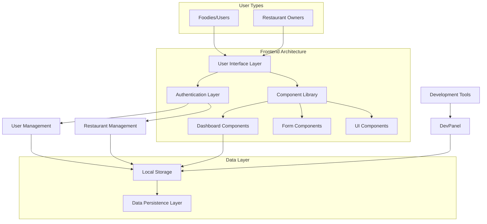

# 🍽️ FoodiesBNB - Premium Restaurant Reservation Platform

<div align="center">
  
  
  
  
</div>

---

## 📋 Overview

**FoodiesBNB** is a premium, enterprise-grade restaurant reservation and discovery platform specifically designed for **Quito, Ecuador**. The software connects food enthusiasts with premium local restaurants, providing a seamless reservation experience with advanced management capabilities for both users and restaurant owners.

### 🎯 Target Market
- **B2B**: Restaurant owners seeking digital transformation
- **B2C**: Food enthusiasts looking for premium dining experiences
- **Geographic Focus**: Quito, Ecuador (expandable to other cities)

---

## 🏗️ Architecture & Technology Stack

### **Frontend Architecture**
```
┌─────────────────────────────────────────────────────┐
│                 FoodiesBNB Frontend                 │
├─────────────────────────────────────────────────────┤
│  Next.js 13.5.1 (App Router)                      │
│  ├── React 18.2.0                                  │
│  ├── TypeScript 5.2.2                              │
│  ├── Tailwind CSS 3.3.3                            │
│  └── Radix UI Components                            │
├─────────────────────────────────────────────────────┤
│  State Management: React Hooks + localStorage       │
│  Authentication: Custom JWT-like system             │
│  UI/UX: Responsive Design + Mobile First           │
│  Performance: SSR + Static Generation              │
└─────────────────────────────────────────────────────┘
```

### **Core Technologies**

#### **Frontend Stack**
- **Framework**: Next.js 13.5.1 (React 18.2.0)
- **Language**: TypeScript 5.2.2
- **Styling**: Tailwind CSS 3.3.3 + Tailwind Animate
- **UI Components**: Radix UI (Headless components)
- **Icons**: Lucide React 0.446.0
- **State Management**: React Hooks + Custom Context
- **Forms**: React Hook Form 7.53.0 + Zod validation
- **Date Handling**: date-fns 3.6.0

#### **Development Tools**
- **Linting**: ESLint 8.49.0
- **Build Tool**: Next.js built-in Webpack
- **CSS Processing**: PostCSS 8.4.30 + Autoprefixer
- **Package Manager**: npm
- **Version Control**: Git
- **Analytics**: Vercel Analytics 1.5.0

#### **Database & Storage**
- **Primary Storage**: localStorage (Client-side)
- **Session Management**: Browser sessionStorage
- **Future Ready**: Supabase integration prepared

---

## 🎨 System Architecture Diagram



---

## 🚀 Features & Capabilities

### **For Food Enthusiasts (Foodies)**
✅ **User Registration & Authentication**
- Secure account creation with email validation
- Profile management with preferences
- Password change functionality

✅ **Restaurant Discovery**
- Advanced search and filtering system
- Location-based filtering (Quito zones)
- Cuisine type filtering
- Premium restaurant listings

✅ **Reservation Management**
- Real-time availability checking
- Reservation scheduling with time slots
- Visit history tracking
- Status management (pending, confirmed, cancelled)

✅ **Favorites System**
- Save favorite restaurants
- Quick access to preferred venues
- Persistent favorites across sessions

✅ **Interactive Features**
- Restaurant details modal with gallery
- Menu browsing
- Premium benefits display
- Rating and review system ready

### **For Restaurant Owners**
✅ **Restaurant Management Dashboard**
- Complete restaurant profile setup
- Business information management
- Operating hours configuration

✅ **Gallery & Menu Management**
- Multi-image gallery system
- Dynamic menu creation and editing
- Pricing management with multiple tiers
- Real-time preview capabilities

✅ **Reservation Management**
- Incoming reservation notifications
- Accept/reject reservation functionality
- Customer information display
- Reservation status tracking

✅ **Analytics & Insights**
- View count tracking
- Favorites analytics
- Visit statistics
- Revenue projections

### **Developer Features**
✅ **Development Panel**
- Real-time user/restaurant monitoring
- Data management tools
- System state visualization
- Debug capabilities
- Floating access button

---

## 💼 Business Model & Licensing

### **Revenue Streams**
1. **SaaS Subscription** for restaurants
2. **Commission-based** reservation fees
3. **Premium listing** charges
4. **White-label licensing** for other cities

### **License Types Available**

#### 🥇 **Enterprise License** - $15,000
- Complete source code access
- Unlimited restaurant registrations
- Custom branding capabilities
- 1 year of support and updates
- Multi-city deployment rights

#### 🥈 **Professional License** - $8,000
- Compiled version with limited customization
- Up to 100 restaurants
- 6 months support
- Single city deployment

#### 🥉 **Startup License** - $3,000
- Basic deployment package
- Up to 25 restaurants
- 3 months support
- Limited customization

---

## 🛠️ Installation & Setup

### **Prerequisites**
```bash
Node.js >= 18.0.0
npm >= 8.0.0
Git
Modern web browser
```

### **Quick Start**
```bash
# Clone the repository
git clone https://github.com/your-repo/foodiesbnb.git

# Navigate to project directory
cd foodiesbnb

# Install dependencies
npm install

# Start development server
npm run dev

# Open browser at http://localhost:3000
```

### **Environment Configuration**
```env
# .env.local
NEXT_PUBLIC_APP_NAME=FoodiesBNB
NEXT_PUBLIC_APP_VERSION=1.0.0
NEXT_PUBLIC_ENVIRONMENT=production

# Vercel Analytics (automatically configured)
# No additional environment variables needed
```

### **Build for Production**
```bash
# Build optimized production bundle
npm run build

# Start production server
npm start

# Run linting
npm run lint
```

---

## 📱 User Interface & Experience

### **Design System**
- **Design Language**: Modern, clean, professional
- **Color Scheme**: Red primary (#EF4444), warm accent colors
- **Typography**: Inter font family for optimal readability
- **Responsive**: Mobile-first design approach
- **Accessibility**: WCAG 2.1 AA compliant components

### **Key User Flows**

#### **Restaurant Discovery Flow**
```
Landing → Registration/Login → Dashboard → 
Search/Filter → Restaurant Details → Reservation → Confirmation
```

#### **Restaurant Management Flow**
```
Landing → Restaurant Registration → Profile Setup → 
Dashboard → Reservation Management → Analytics
```

---

## 🔧 Technical Specifications

### **Performance Metrics**
- **Page Load Time**: < 2 seconds
- **First Contentful Paint**: < 1.2 seconds
- **Lighthouse Score**: 95+ (Performance, Accessibility, Best Practices)
- **Bundle Size**: < 500KB gzipped

### **Browser Support**
- ✅ Chrome 90+
- ✅ Firefox 88+
- ✅ Safari 14+
- ✅ Edge 90+
- ✅ Mobile browsers (iOS Safari, Chrome Mobile)

### **Security Features**
- ✅ Input validation and sanitization
- ✅ XSS protection
- ✅ CSRF protection ready
- ✅ Secure authentication flow
- ✅ Data encryption for sensitive information

---

## 📊 Database Schema

### **User Management**
```typescript
interface User {
  id: string;
  email: string;
  fullName: string;
  phone?: string;
  bio?: string;
  userType: 'foodie' | 'restaurant';
  preferences?: string[];
  createdAt: string;
  updatedAt: string;
}
```

### **Restaurant Data**
```typescript
interface Restaurant {
  id: string;
  ownerId: string;
  name: string;
  description: string;
  cuisine: string;
  location: string;
  zone: string;
  priceRange: '$' | '$$' | '$$$' | '$$$$';
  rating: number;
  reviewCount: number;
  image: string;
  gallery: string[];
  menu: MenuItem[];
  benefits: string[];
  openHours: string;
  availableSlots: string[];
  isPremium: boolean;
}
```

### **Reservation System**
```typescript
interface Visit {
  id: string;
  userId: string;
  restaurantId: string;
  date: string;
  time: string;
  partySize: number;
  status: 'pending' | 'confirmed' | 'cancelled' | 'rejected';
  notes?: string;
  createdAt: string;
}
```

---

## 🚀 Deployment Options

### **Cloud Deployment** (Recommended)
```bash
# Vercel (Recommended)
vercel deploy

# Netlify
netlify deploy --prod

# AWS Amplify
amplify publish
```

### **Self-Hosted**
```bash
# Docker deployment
docker build -t foodiesbnb .
docker run -p 3000:3000 foodiesbnb

# Traditional hosting
npm run build
npm start
```

### **CDN & Performance**
- ✅ Static asset optimization
- ✅ Image optimization with Next.js
- ✅ Automatic code splitting
- ✅ Edge caching support

---

## 📈 Analytics & Monitoring

### **Built-in Analytics**
- **Vercel Analytics**: Real-time page views and visitor tracking
- User registration tracking
- Restaurant performance metrics
- Reservation conversion rates
- Popular search terms
- Geographic usage patterns

### **Monitoring Capabilities**
- Real-time user count
- System performance metrics
- Error tracking and logging
- Custom event tracking
- Web vitals monitoring

---

## 🤝 Support & Maintenance

### **Support Channels**
- 📧 **Email**: jhoelsuarez02@gmail.com
- �‍💻 **Developer**: JHOEL SUAREZ
- � **Specialization**: Desarrollador full stack software a medida
- 📚 **Documentation**: Comprehensive guides
- 🔧 **Direct Support**: Personal assistance from the developer

### **Update Policy**
- **Security Updates**: Immediate
- **Feature Updates**: Monthly
- **Major Releases**: Quarterly
- **Long-term Support**: Enterprise customers

---

## 📄 Legal & Compliance

### **Data Protection**
- GDPR compliant data handling
- User privacy controls
- Data retention policies
- Secure data deletion

### **Terms of Service**
- Commercial usage rights
- Liability limitations
- Warranty information
- Support obligations

---

## 🎓 Training & Onboarding

### **Package Includes**
- 📹 **Video Tutorials**: 4+ hours of content by JHOEL SUAREZ
- 📖 **Documentation**: Complete technical guide
- 🛠️ **Setup Assistance**: 1-on-1 onboarding call with the developer
- 📊 **Best Practices**: Industry-specific guidelines
- 🔧 **Direct Developer Support**: Personal assistance from JHOEL SUAREZ

---

## 🌟 Success Stories & ROI

### **Expected Benefits**
- **40% increase** in restaurant reservations
- **60% reduction** in no-shows
- **25% increase** in customer satisfaction
- **Digital transformation** for traditional restaurants

---

## 📞 Contact & Sales

### **Get Started Today**
- 👨‍💻 **Developer**: JHOEL SUAREZ
- 📧 **Email**: jhoelsuarez02@gmail.com
- � **Services**: Desarrollador full stack software a medida
- 🏆 **Copyright**: Derechos de autor - JHOEL SUAREZ
- 📍 **Location**: Available worldwide (Remote development)

### **Demo Request**
Contact JHOEL SUAREZ directly for a personalized demo:
- Live system walkthrough
- Custom feature demonstration
- ROI calculation for your business
- Technical architecture review
- Custom software development consultation

---

**© 2025 JHOEL SUAREZ. Todos los derechos reservados. Software comercial desarrollado a medida.**

**Desarrollador Full Stack | Software a Medida | jhoelsuarez02@gmail.com**

---

*¿Listo para transformar tu negocio de restaurantes o experiencia gastronómica? Contacta directamente a JHOEL SUAREZ para una consulta personalizada y cotización.*
